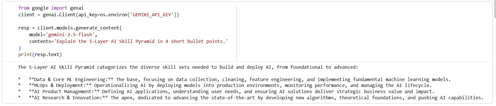

# AI Mentor Bootcamp — Bhallamudi Pavan
## Day 1 — Setup complete

- ✅ Google AI Studio API key provisioned
- ✅ Groq API key provisioned
- ✅ Hello-Gemini call working — see [Day1_Setup.ipynb](Day1_Setup.ipynb)
- 4-tool comparison matrix from Lab 1A: see screenshot below

## Day 2 - Resume Parser Notebook Added
- ✅ `Day2_ResumeExtractor.ipynb` runs end-to-end without errors
- ✅ 3 sample résumés processed successfully
- ✅ Empty-input case handled gracefully (ValidationError caught)
- ✅ README documents the 3 errors handled with technical detail
- ✅ Notebook pushed to GitHub
